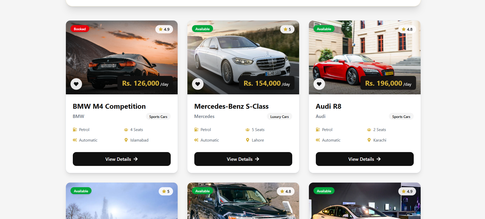
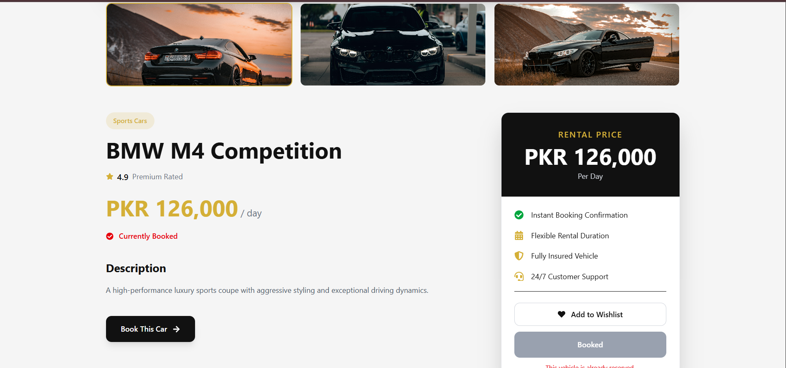
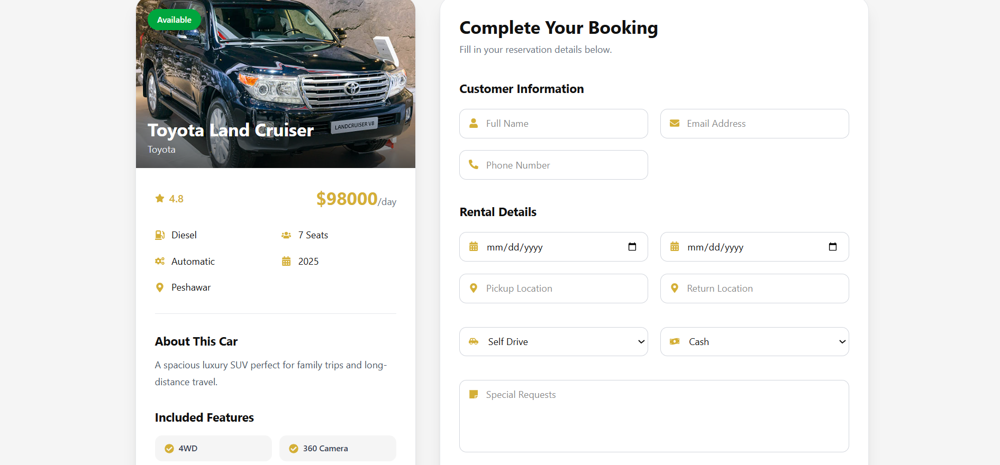
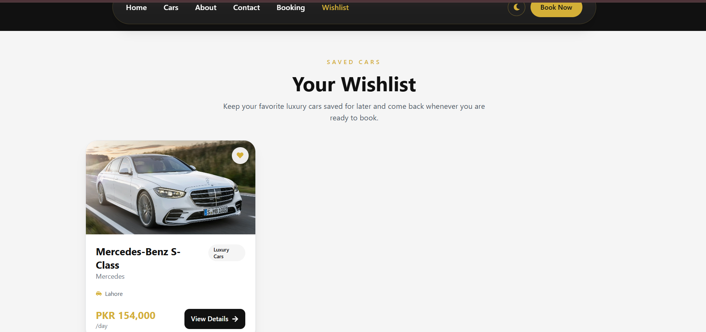
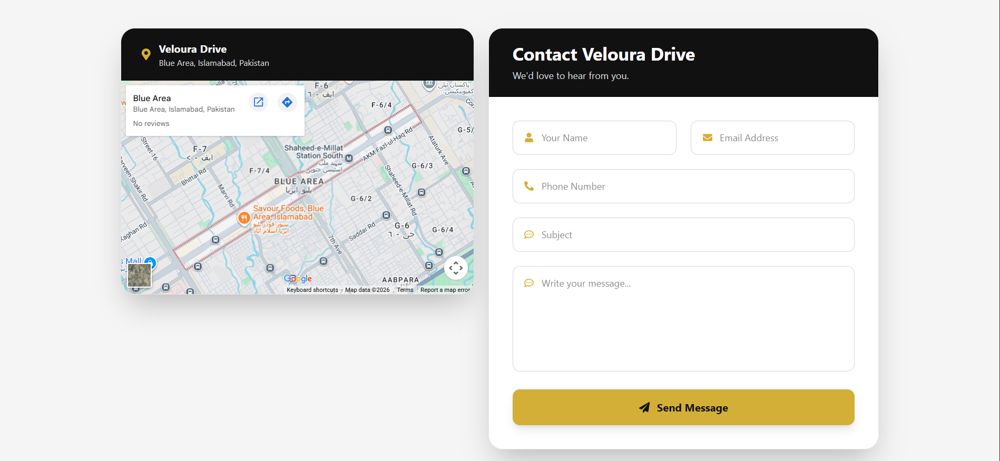

# 🚗 Veloura Drive – Premium Car Rental

<div align="center">

### Luxury Car Rental Platform Built with React

A modern, responsive premium car rental web application where users can browse luxury vehicles, view detailed specifications, book cars online, manage wishlists, and contact the company.

---


</div>

---

# ✨ Features

## 🚘 Premium Car Catalog

- Browse luxury vehicles
- Search by car name or brand
- Filter by category
- Sort by price
- Responsive car cards

---

## 🚗 Car Details

- High-quality image gallery
- Vehicle specifications
- Features list
- Booking price card
- Related cars
- Smooth animations

---

## 📅 Booking System

- Select a car directly from Car Details
- Dynamic booking form
- Rental duration calculation
- Automatic total price calculation
- Booking summary
- Success confirmation modal

---

## ❤️ Wishlist

- Save favourite vehicles
- Remove vehicles
- Persistent local storage

---

## 📞 Contact

- Modern contact form
- Company information
- Google Maps integration
- Social media section

---

## 📱 Responsive Design

Optimized for:

- Desktop
- Laptop
- Tablet
- Mobile

---

# 🛠 Tech Stack

### Frontend

- React
- Vite
- Tailwind CSS
- React Router
- React Query
- Axios
- Framer Motion
- React Icons

### Development

- JSON Server
- ESLint
- Git
- GitHub

---

# 📂 Folder Structure

```text
src
│
├── assets
├── components
│   ├── About_page
│   ├── Booking_page
│   ├── Cardetail_page
│   ├── Contact_page
│   ├── Home_page
│   ├── Navbar
│   ├── Footer
│   └── UI Components
│
├── hooks
│   ├── useCars.js
│   ├── useCar.js
│   ├── useCreateBooking.js
│   └── useCreateContact.js
│
├── layouts
├── pages
│   ├── Home
│   ├── Cars
│   ├── CarDetails
│   ├── Booking
│   ├── Wishlist
│   ├── About
│   ├── Contact
│   └── NotFound
│
├── services
│   ├── api.js
│   ├── carService.js
│   ├── bookingService.js
│   └── contactService.js
│
├── utils
├── App.jsx
└── main.jsx
```

---

# 🚀 Installation

Clone the repository

```bash
git clone https://github.com/malaikaahsan/premium-car-rental.git
```

Go inside the project

```bash
cd premium-car-rental
```

Install dependencies

```bash
npm install
```

Run the development server

```bash
npm run dev
```

---

# 🗄 API Setup

This project currently uses **JSON Server**.

Install JSON Server

```bash
npm install json-server
```

Run the API

```bash
npx json-server src/data/db.json --port 5000
```

API Endpoint

```
http://localhost:5000/cars
```

---

# 📷 Screenshots

## 🏠 Home Page


---

## 🚘 Cars Page



---

## 🚗 Car Details




---

## 📅 Booking Page




---

## ❤️ Wishlist




---

## 📞 Contact Page




---

# 🎨 Design Theme

Primary Colors

- Gold — `#D4AF37`
- Black — `#111111`
- White — `#FFFFFF`
- Gray — `#F5F5F5`

---

# 🚀 Deployment

### Frontend

**Live Website**

👉 https://premium-car-rental-ochre.vercel.app/

### Backend

JSON Server (Local Development)

---

# 📌 Future Improvements

- Authentication
- User Dashboard
- Admin Panel
- Online Payments
- Reviews & Ratings
- Booking History
- Firebase / Supabase Backend
- Email Notifications

---

# 👩‍💻 Author

**Malaika Ahsan**

GitHub

https://github.com/malaikahsan

LinkedIn

https://www.linkedin.com/in/malaika-ahsan/

---

# ⭐ Support

If you like this project, don't forget to **Star ⭐ the repository**.
